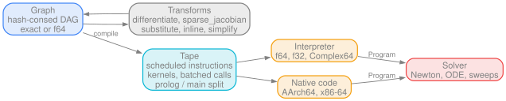
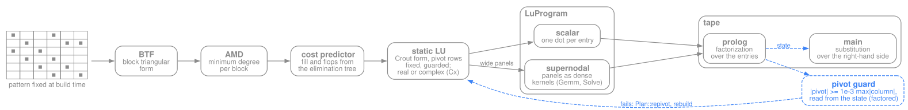
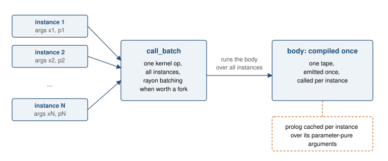
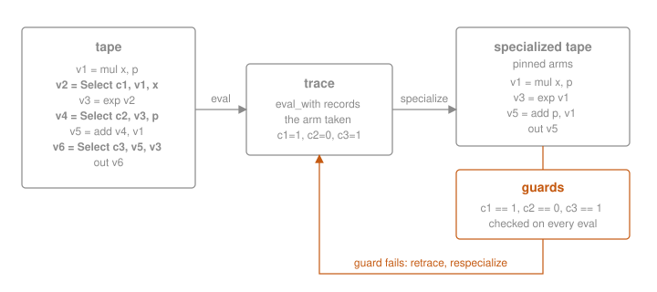
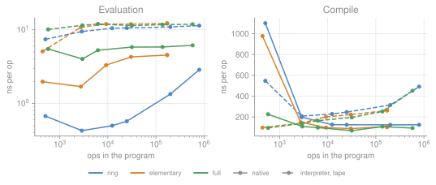
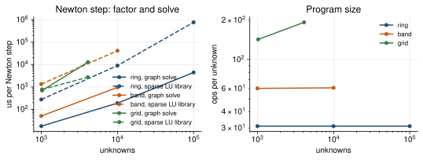
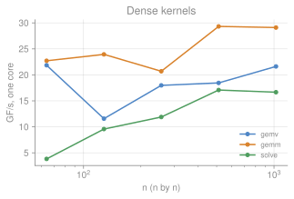

# rsdag

Expression graph compiler for the equation systems of simulators (DAEs,
ODEs, circuits, state-space blocks): a hash-consed expression graph with
forward and reverse differentiation, a flat instruction tape, an
interpreter over any scalar type, a native code backend for AArch64 and
x86-64, and a sparse linear solve compiled into the same tape.



Licensed under the [GNU Affero General Public License v3.0](LICENSE): free to
use, modify and distribute, including commercially, as long as the source of
the combined work stays available under the same license, network use
included. The copyright holder licenses rsdag on other terms as well (see
NOTICE); for a commercial license contact info@milanrother.com.

## Crates

- `rsdag`: `Graph<K: Field>` (exact rationals or `f64`), functions with
  calls and roles, `Scope`, `Module` (serialization), `differentiate`,
  `gradient` (reverse mode), `sparse_jacobian`, `hessian`, `substitute`,
  `Tape` (interpreter over any `Scalar`, choice specialization, instance
  batching, `Gemv`, `Gemm` and dense `Solve` kernels, prolog/main split),
  `semantics` (the reference arithmetic), `symbolic` (`determinant`,
  `collect`, `rational_form`, `simplify_egraph`, the sparse solve,
  `newton_step`).
- `rsdag-jit`: `NativeTape`, machine code for AArch64 and x86-64 on Linux,
  macOS and Windows; function bodies compiled once and batched over
  instances; `eval_many` over many input sets.
- `rsdag-py`: Python package `rsdag` (`trace`, `jit`, `jacobian`, `grad`,
  `where`, `matmul`, `solve`), built with maturin.

Dependencies of the core: `rustc-hash`, `libm`. `Graph` is `Graph<F64>`.
Features:

| feature | adds | dependencies |
|---|---|---|
| `exact` | `Graph<BigRational>`, folding without rounding | num-bigint, num-rational |
| `complex` | evaluation in `Complex64` | num-complex |
| `egraph` | `simplify_egraph` (implies `exact`, native only) | egg |
| `serde` | `Module` serialization | serde |

`rsdag` builds for `wasm32-unknown-unknown` (interpreter only) with every
feature except `egraph`. It reads no clock unless `hooks::set_clock`
installs one.

## Graph

Nodes are hash-consed; ascending ids are a topological order. Constructors
fold constants in `K` and apply the algebraic identities.
`Graph::fingerprint` is a structural hash of a node, the same in any graph,
on any platform and in any build order; the terms of a sum or product are
ordered by it. A function is a
graph over positional parameters with named outputs; `Call` applies it;
derivative outputs are derived from the body on first demand. Parameters
and outputs carry roles (state, input, parameter, time; residual,
derivative, guard with its crossing direction, state write).

## Tape

`Tape::compile` lowers a set of roots into an instruction IR, schedules it
for register pressure, allocates slots by liveness and emits the
instruction list. Row dots against one vector lower to `Gemv`, against
several vectors to `Gemm`, a dense system to a pivoting `Solve`; calls of
one function on distinct argument lists lower to one batched call. A
kernel output whose one consumer subtracts it, adds it or negates it is
folded by the kernel (`Fold`): the consumer vanishes and the kernel writes
`c - d`, `c + d` or `-d`, the accumulator `c` an operand or another
output of the same kernel.
`Tape::compile_split` marks parameter-pure inputs; the tape then has a
prolog evaluated once per parameter binding and a main part evaluated per
iteration. `Tape::eval` runs over any `Scalar` (`f64`, `f32`, `Complex64`).

Evaluation is allocation-free once the buffers exist. `Tape::work_len` and
`out_len` size them, `eval_into` writes into slices the caller owns,
`Tape::runner` holds the buffers itself. Function bodies: `ExternBundle::work_len`
and `call_into` take a caller-owned buffer, `call` uses a thread-local one.
`NativeTape::compile` emits the same instruction sequence as machine code
in chunked functions with a write-back register cache.

## Sparse solve



`symbolic::solve` lowers the solve of a system with a known sparsity
pattern into graph ops: block triangular form, minimum-degree ordering per
block, a fill and flop predictor over the elimination tree, and a static LU
in Crout form with the right-hand side as the last column. Pivot rows are
fixed at build time. A step with more than one structural candidate emits a
guard, `|pivot| >= 1e-3 max|column|`; on a failed guard `Plan::repivot`
takes the rows of a numeric elimination on the current values and the
program is rebuilt. With the matrix entries as parameter-pure inputs and
the right-hand side as main inputs, the prolog is the factorization and
the main part the substitution.

The eliminations are generic over the scalar (`Num`): a real expression,
or a complex one as a pair of real expressions (`Cx`), which lowers a
complex system to real ops at build time, the guard comparing moduli.
`solve_block_planned` eliminates a pattern of dense or diagonal blocks
(`Block`, of one size or of `sizes` per block row): pivot blocks through
the dense solve kernel, block updates as dot products that fuse into
`Gemm` kernels, a guard per pivot block against the rows below it.
`solve_supernodal_planned` runs the scalar plan's elimination over panels
(`supernodes`: steps along the postordered elimination forest merged
while their explicit zeros stay within an allowance), the fill of the
scalar ordering with the flops in the kernels.

## Function bodies



A multiply-instantiated model is one function and one call per instance.
The body is compiled once; calls with the same shape lower to one kernel op
that runs the body over all instances, on the rayon pool above a size
threshold. `Graph::set_func_body` registers a body compiled by the caller;
programs whose calls it covers use it.

## Choice specialization



`Tape::eval_with` records the arm taken by each `Select`. `Tape::specialize`
pins the recorded arms and shortens the tape to that region; the pinned
conditions remain as guards. A failed guard means the region changed: the
full tape is retraced and the specialization rebuilt. Guards that depend
only on parameters are in the prolog and checked once per parameter
binding.

## Bit-exactness

All backends compute the same IEEE operation sequence: no fast-math, no
fused multiply-add, one reference routine per elementary function, one
four-accumulator order for reductions and dot products, the same domain
guards. `rsdag::synth` generates random programs over the whole op
vocabulary; the test suites compare the arena sweep, the tape, the native
code and the typed evaluation on them bit for bit.

The elementary functions are Rust code, no platform library: `exp`, `ln`,
`sinh`, `cosh`, `tanh` and `powi` in `rsdag::math`, the rest from the `libm`
crate, complex ones built from these. Results are the same bits on
AArch64, x86-64 and wasm32.

| | max error | ns per call (M3) |
|---|---|---|
| `exp` | 0.51 ulp on [-700, 700], 1.0 ulp toward underflow | 1.8 |
| `ln` | 0.78 ulp | 2.9 |
| `sinh` | 1.75 ulp | 4.1 |
| `cosh` | 1.01 ulp | 3.9 |
| `tanh` | 2.1 ulp | 4.1 |

## Numbers

One core of an Apple M3, release profile. `docs/bench/plot.py` draws the
figures from the CSVs in `docs/bench/data` (sources in
`docs/bench/README.md`).

Evaluation cost per op, interpreter and native, and native compile cost
per op, over program size and op vocabulary:



Newton step of a circuit-like system, sparse solve as a program against a
general sparse LU library (rslab, KLU path), and the program size per
unknown, over the number of unknowns and the pattern family:



The dense kernels' throughput over the matrix size:



## Rust

```rust
use rsdag::{Graph, Tape, SymbolId};

let mut g: Graph = Graph::new();          // f64 constants; Graph<BigRational> with `exact`
let (x, y) = (g.sym("x"), g.sym("y"));
let e = { let s = g.sin(x); g.mul(s, y) };
let dx = rsdag::differentiate(&mut g, e, SymbolId(0));
let tape = Tape::compile(&g, &[e, dx], &[SymbolId(0), SymbolId(1)]);
let (mut work, mut out) = (Vec::new(), Vec::new());
tape.eval(&[0.5, 2.0], &mut work, &mut out);
```

## Python

```python
import numpy as np
from rsdag import jit, jacobian, matmul, solve

def lorenz(x, t):
    s, r, b = 10.0, 28.0, 8.0 / 3.0
    return [s * (x[1] - x[0]), x[0] * (r - x[2]) - x[1], x[0] * x[1] - b * x[2]]

f = jit(lorenz, native=True)              # traces on first call, then native
y = f(np.array([1.0, 2.0, 3.0]), 0.0)
J = jacobian(lorenz)(np.array([1.0, 2.0, 3.0]), 0.0)   # (3, 3), symbolic
g = jit(lambda A, x: solve(A, matmul(A, x)))            # one Gemv, one Solve
```

Data-dependent Python control flow is not traceable; `where(cond, a, b)`
with `gt`, `lt`, ... expresses elementwise conditions.

## Build

```
cargo test --workspace
scripts/ci.sh                                            # the CI gate, locally
maturin build --release -m crates/rsdag-py/Cargo.toml   # the Python wheel
```
