# rsdag

Expression graph backend for hybrid event and continuous ODE and DAE
simulators: a hash-consed expression graph with functions and calls,
forward and reverse differentiation, a flat instruction tape split into a
per-parameter prolog and a per-iteration main phase, an interpreter over
any scalar type, and a native code backend for AArch64 and x86-64.

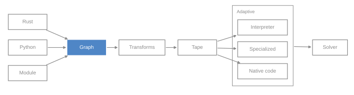

A simulator's model through rsdag: roles order the inputs, the residuals
and their Jacobian compile into one program whose prolog runs once per
parameter binding and whose main phase runs per iteration; the consumer's
loop factors the Jacobian with a sparse LU library, drives the program and
handles the events its guards report.

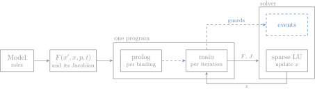

Licensed under the [GNU Affero General Public License v3.0](LICENSE): free to
use, modify and distribute, including commercially, as long as the source of
the combined work stays available under the same license, network use
included. The copyright holder licenses rsdag on other terms as well (see
NOTICE); for a commercial license contact info@milanrother.com.

## Crates

- `rsdag`: `Graph<K: Field>` (exact rationals or `f64`), functions with
  calls and roles, bindings (`Graph::bind`), composition (`Graph::import`,
  hierarchies compiled through templates),
  `Scope`, `Module` (serialization), `differentiate`,
  `gradient` (reverse mode), `sparse_jacobian`, `substitute`, `Tape`
  (interpreter, choice specialization, instance batching, `Gemv`, `Gemm`
  and dense `Solve` kernels, prolog/main split), `semantics` (the reference
  arithmetic), `parallel` (a program's independent calls on a pool,
  `Workers`), `dot` (a graph's DAG as data for a viewer).
- `rsdag-jit`: `NativeTape`, machine code for AArch64 and x86-64 on Linux,
  macOS and Windows; function bodies compiled once and batched over
  instances, on x86-64 in vector lanes; `eval_many` over many input sets in parallel
  (`Program::eval_many_into` serially, on either backend). `rsdag_jit::compiler()` is
  the native `Compiler` for `Adaptive`.
- `rsdag-py`: Python package `rsdag` (`trace`, `jit`, `jacobian`, `grad`,
  `where`, `matmul`, `solve`; traced programs compose), built with maturin.

Dependencies of the core: `rustc-hash`, `libm`. `Graph` is `Graph<F64>`.
Features:

| feature | adds | dependencies |
|---|---|---|
| `exact` | `Graph<BigRational>`, folding without rounding | num-bigint, num-rational |
| `serde` | `Module` serialization | serde |

`rsdag` builds for `wasm32-unknown-unknown` (interpreter only) with every
feature. It reads no clock unless `hooks::set_clock` installs one.

## Architecture

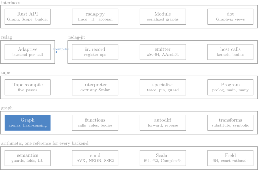

The layers, each built on the ones below. The core does not depend on the
native backend: `rsdag-jit` implements `Compiler`, `Adaptive` takes one.
Every backend computes through `semantics`, the one reference arithmetic.

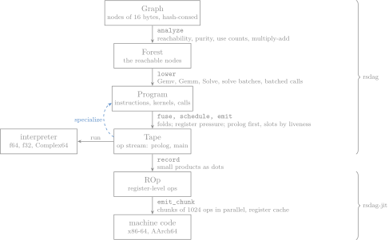

The representations a program passes through and the passes between them.
`Tape::specialize` lifts a tape back to a program, pins its choices and
schedules and emits it again.

## Graph

Nodes are hash-consed; ascending ids are a topological order. Constructors
fold constants in `K` and apply the algebraic identities.
`Graph::fingerprint` is a structural hash of a node, the same in any graph,
on any platform and in any build order; the terms of a sum or product are
ordered by it. A function is a
graph over positional parameters with named outputs; `Call` applies it;
derivative outputs are derived from the body on first demand. Parameters
and outputs carry roles (state, input, parameter, time; residual, charge,
derivative, guard with its crossing direction, state write).

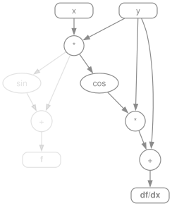

`f = sin(x y)` and `differentiate(f, x)` in one graph: the derivative
reuses the product `x y`; its own nodes are dashed.

## Tape

`Tape::compile` lowers a set of roots into an instruction IR, schedules it
for register pressure, allocates slots by liveness and emits the
instruction list. Row dots against one vector lower to `Gemv`, against
several vectors to `Gemm`, a dense system to a pivoting `Solve`; calls of
one function on distinct argument lists lower to one batched call. A
kernel output whose one consumer subtracts it, adds it or negates it is
folded by the kernel (`Fold`): the consumer vanishes and the kernel writes
`c - d`, `c + d` or `-d`, the accumulator `c` an operand or another
output of the same kernel.
`Tape::compile_split` marks parameter-pure inputs; the tape then has a
prolog evaluated once per parameter binding and a main part evaluated per
iteration. The prolog's results are `work[..Tape::state_len()]`, the same
layout in every backend.

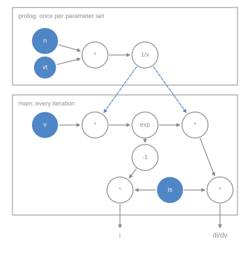

A diode current and its derivative in `v` with parameters `is`, `n`, `vt`,
compiled with `compile_split`: `1/(n vt)` is the prolog, the dashed edges
are the state the main phase reads.

`Adaptive` serves a tape by the interpreter, its choice specialization or
native code (with a `Compiler`, compiled in the background), chosen per
call; `Policy` sets the thresholds. `Adaptive::eval_prolog` returns the
`Episode` its main phases run in; interpreter and native code share the
state layout, so an episode moves between them, and a specialized one
falls back to the full tape when a region flips.

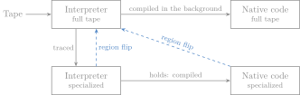

Evaluation is allocation-free once the buffers exist. `Tape::work_len` and
`out_len` size them, `eval_into` writes into slices the caller owns.
Function bodies: `ExternBundle::work_len`
and `call_into` take a caller-owned buffer; a calling tape lends its own.
`NativeTape::compile` emits the same instruction sequence as machine code
in chunked functions with a write-back register cache.

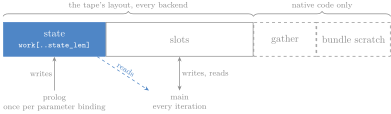

The work array: the prolog's results first, then the main phase's slots,
the same layout in every backend, then a gather area where the calls (and
in native code the host routines) gather their arguments, and the scratch
of called bodies. Interpreter and native code run their calls through one
runner (`tape::calls`).

## Function bodies

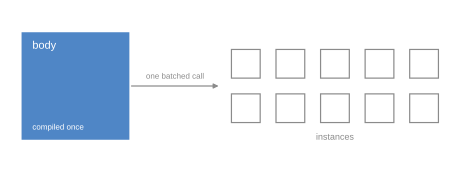

A multiply-instantiated model is one function and one call per instance.
The body is compiled once; calls with the same shape lower to one kernel op
that runs the body over all instances, serially or on the current rayon
pool as `rsdag_jit::Options::batch` says.

On x86-64 a batch also runs in lanes: the body compiled once more per
width over several instances at once, one in each lane of every vector
register (four with AVX, two with SSE2), bit for bit the scalar code. Per
phase, a cost estimate decides whether lanes pay and how a batch splits
into blocks of each width and single instances; `rsdag_jit::Options::lanes`
forces or disables them.

Parameters with the `Param` role are a body's pure arguments; its tape is
split over them. A caller compiled with `compile_split` whose prolog has
those arguments runs the body's prolog per instance in its own prolog and
keeps the result in its work buffer (`ExternBundle::state_len`,
`prolog_into`, `main_into`); per evaluation only the rest of the body runs.

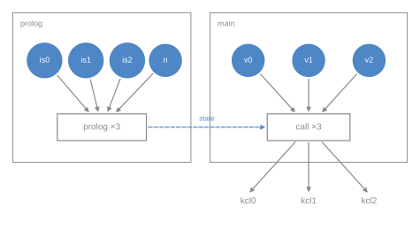

Three instances of a `diode(a, b, is, n)` body in a ring, `is` and `n`
with the `Param` role: the prolog runs the body's parameter part for all
three instances, the main phase one batched call.

## Composition

Programs built apart compose. A function of one graph comes into another
with `Graph::import`, the functions it calls along (a structurally equal
function already there is reused), and calls into it build the
composition. A hierarchy (blocks of blocks, subcircuits of devices) stays
functions for the symbolic work: a derivative through a call follows only
what the called output reads (`Graph::output_support`), and specialization
makes one copy per pattern of constant arguments. A model card is a
binding: `Graph::bind` binds parameters of a function once, a call through
it (`Graph::calls_bound`) carries only the instance's own arguments, and
every analysis, derivative and program takes it as the call with all its
arguments. The program over a hierarchy compiles as it stands
(`Tape::compile`): a function whose body calls others is lowered once into
a template, a call of it appends the template, the leaves stay calls, so
the calls of one leaf from every instance anywhere in the hierarchy run as
one batch; after its prolog, such a batch gathers per evaluation only the
arguments its main phase reads, not the bound card. The calls of one
instance share one argument list, and every stage works on it once per
instance, so a body of n nodes called once costs O(n), whatever its number
of outputs (see Benchmarks).

In Python, a traced program called with tracers inside another trace is
one instance of it there, not unrolled:

```python
cell = jit(lambda a, b: [a * b, np.sin(a)])
chain = jit(lambda x: [cell(x[k], x[k + 1])[0] for k in range(len(x) - 1)])
J = jacobian(chain)(np.linspace(0.0, 1.0, 100))   # cell's calls: one batched kernel
```

## Parallel

A tape groups consecutive calls that read nothing another of them writes
into stages (`Tape::stages`): the device instances of a circuit, the blocks
of a model. With a pool installed (`parallel::install`), every instance of
every call in a stage is a piece of work of its own, on the interpreter and
in native code alike; a stage too small to be worth it runs serially. Each
piece computes what the serial loop computes, so the results are the same
bit for bit whatever the thread count, and a call inside a stage runs its
own stages serially.

`parallel::Workers` is the pool for it: its workers keep waiting for the
next stage for a few hundred microseconds before they sleep, and the
calling thread takes pieces too, so the stages of a solve, a factorization
or a step decision apart, reach awake workers. Any `parallel::Pool` serves.

```rust
use std::sync::Arc;
use rsdag::parallel::{self, Parallel, Workers};

let p = Parallel::new(Arc::new(Workers::new(4)));
parallel::install(p, || {
    tape.eval_prolog(&x, &mut work);
    for _ in 0..iterations {
        tape.eval_main(&x, &mut work, &mut out);   // stages on 4 threads
    }
});
```

On SANE's circuits (the modules of the Benchmarks), the Jacobian takes 7
to 12 microseconds on 4 threads instead of 11 to 18 on one, the residual
3 to 6 instead of 6 to 9 (`rsdag-jit/examples/modules.rs --threads`).

## Choice specialization

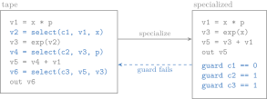

`Tape::eval_with` records the arm taken by each `Select`. `Tape::specialize`
pins the recorded arms and shortens the tape to that region; the pinned
conditions remain as guards. A failed guard means the region changed: the
full tape is retraced and the specialization rebuilt. Guards that depend
only on parameters are in the prolog and checked once per parameter
binding.

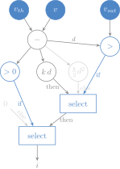

A piecewise model at `v = 1` (on, linear region): the arms taken and the
conditions that guard them are kept; the faded arms are not in the
specialized tape.

## Diagrams

`dot::GraphView` gives a graph under some roots as data for a viewer that
lays it out itself: one node per expression with its kind, a shared
subexpression once, a focus set at full strength and the rest faded,
clusters, extra links, and the bodies of the calls in nested frames
(`bodies`, or `inline` for every instance). The operators are labelled in
the notation `Ascii` or `Math`.

## Bit-exactness

All backends compute the same IEEE operation sequence: no fast-math, no
fused multiply-add, one reference routine per elementary function, one
four-accumulator order for reductions and dot products, the same domain
guards. `rsdag::synth` generates random programs over the whole op
vocabulary; the test suites compare the arena sweep, the tape and the
native code on them bit for bit.

## Benchmarks

Measured on one core of an AMD Ryzen 9 9900X (Windows 11) by `scripts/bench.sh`.

Evaluation cost per op, interpreter and native, and compile cost per op,
tape and native, over program size and op vocabulary:

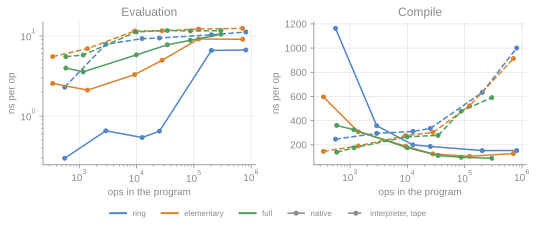

The dense kernels' throughput over the matrix size:

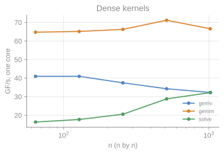

Small matrices as models have them (controllers, filters, state space,
macromodels): `A x`, `A B` and `A \ b` of n by n inputs through a tape,
one instance and sixteen of one shape, per instance. The products fuse into
one kernel from two rows on; native code writes a product of fewer than
eight rows out as its entries' dots, and a solve of up to sixteen unknowns
runs with its size a constant. Solves of one shape that do not read each
other's solutions run as one batch, four systems side by side in a vector,
each bit-identical to its own solve.

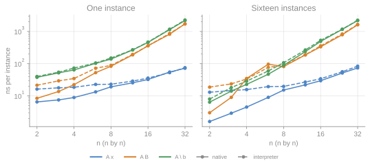

A hierarchy's symbolic work over the size of one body: a body of n circuit
nodes (a ring of n devices, a capacitor per node, every node's current an
output) called once, its calls (`calls`), the
Jacobian through it, the residual specialized to `x' = 0` and the program
compiled from it (`Tape::compile`). Each grows linearly with the body, not
with the body times its outputs (`rsdag/examples/hierarchy.rs`).

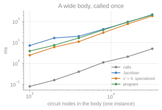

Against CasADi and JAX on circuits: the twelve AnalogGym amplifiers
(BSIM4), a nine-stage PSP103 ring oscillator and the uA741, as SANE exports
them (rsdag modules; `rsdag-jit/examples/modules.rs`,
`docs/bench/modules.py`). The residual and its Jacobian on one core, per
call and the setup before the first call (building and compiling the
function): the DC residual (the derivatives and time the constant zero,
rsdag's calls specialized to them), with the parameters as inputs (rsdag
keeps them in the prolog) and as constants (every instance's parameter
branches decided at build time). Hatched: rsdag's interpreter on the same
tape as its native code. The circuits are hierarchical (subcircuits of
devices); CasADi and JAX get them composed into one function by rsdag
first, so all three start from the same expressions. CasADi builds SX
functions and runs through its buffer interface, JAX maps each device body
over its instances with `vmap` and builds the Jacobian dense; it compiles
neither the PSP103 nor the BSIM4 Jacobians within a minute.

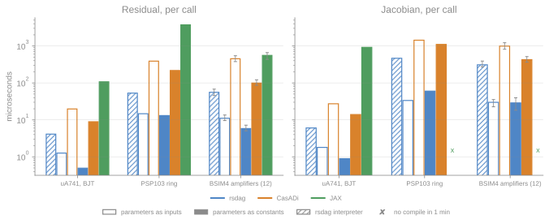

## Rust

```rust
use rsdag::{Graph, Tape, SymbolId};

let mut g: Graph = Graph::new();          // f64 constants; Graph<BigRational> with `exact`
let (x, y) = (g.sym("x"), g.sym("y"));
let e = { let s = g.sin(x); g.mul(s, y) };
let dx = rsdag::differentiate(&mut g, e, SymbolId(0));
let tape = Tape::compile(&g, &[e, dx], &[SymbolId(0), SymbolId(1)]);
let (mut work, mut out) = (Vec::new(), Vec::new());
tape.eval(&[0.5, 2.0], &mut work, &mut out);
```

## Python

```python
import numpy as np
from rsdag import jit, jacobian, matmul, solve

def lorenz(x, t):
    s, r, b = 10.0, 28.0, 8.0 / 3.0
    return [s * (x[1] - x[0]), x[0] * (r - x[2]) - x[1], x[0] * x[1] - b * x[2]]

f = jit(lorenz, native=True)              # traces on first call, then native
y = f(np.array([1.0, 2.0, 3.0]), 0.0)
J = jacobian(lorenz)(np.array([1.0, 2.0, 3.0]), 0.0)   # (3, 3), symbolic
Js = jacobian(lorenz, sparse=True)       # the nonzeros; Js.pattern(x, t): rows, cols
g = jit(lambda A, x: solve(A, matmul(A, x)))            # one Gemv, one Solve
```

Data-dependent Python control flow is not traceable; `where(cond, a, b)`
with `gt`, `lt`, ... expresses elementwise conditions.

## Build

```
cargo test --workspace
scripts/ci.sh                                            # the full gate, locally
scripts/diagrams.sh                                      # the README diagrams (needs TeX Live or MiKTeX)
scripts/bench.sh                                         # the README benchmarks, measured afresh (needs matplotlib)
scripts/social.sh                                        # the cards in docs/social (needs matplotlib)
maturin build --release -m crates/rsdag-py/Cargo.toml   # the Python wheel
```
